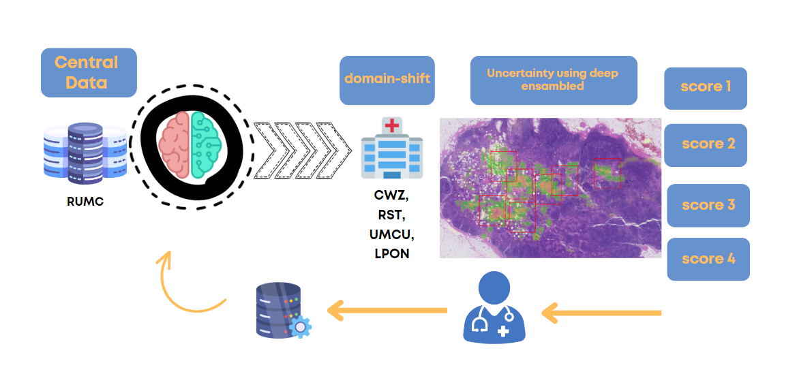

# Collaborative segmentation method using uncertainty-guided annotation sampling

This project introduces a novel human-in-the-loop deep learning pipeline aimed at enhancing the efficiency and accuracy of cancer cell segmentation in digital pathology. By incorporating per-pixel and local-level model uncertainty, the pipeline provides valuable insights into model limitations, enabling pathologists to make more informed diagnoses. Our results demonstrate that using fewer annotated samples can still yield higher segmentation performance when focusing on out-of-domain areas identified by model uncertainty

We address the challenge of handling out-of-domain (OOD) scenarios in medical data using a human-in-the-loop approach. Our model is trained on Whole Slide Images (WSIs) and incorporates uncertainty measurements to identify and correct misclassifications.

An adapted version of nnUNet, specifically tuned for pathology data 
[nnUNet for Pathology](https://github.com/DIAGNijmegen/nnUNet-for-pathology/tree/nnunet_for_pathology_v1)

Data: 137 WSIs from RUMC, part of Camelyon 16; tested on 75 WSIs from Camelyon 17.
Patch Size: $1024\times 1024$ pixels.
Training: 5-fold cross-validation; batch size of 2.
We quantify uncertainty based on the internal disagreement among the 5-folds. Patches with high uncertainty are flagged for user review. The corrected data is then used to retrain the model, improving its performance iteratively.

This condensed version maintains the essence and critical points of your original text. Feel free to use or adjust as you see fit.

## Quickstart guide

The collaborative is based on certainty and is flexible to adapt it to the certainty of your choice. We suggest to use nnunet segmentation with five folds and apply on your 

